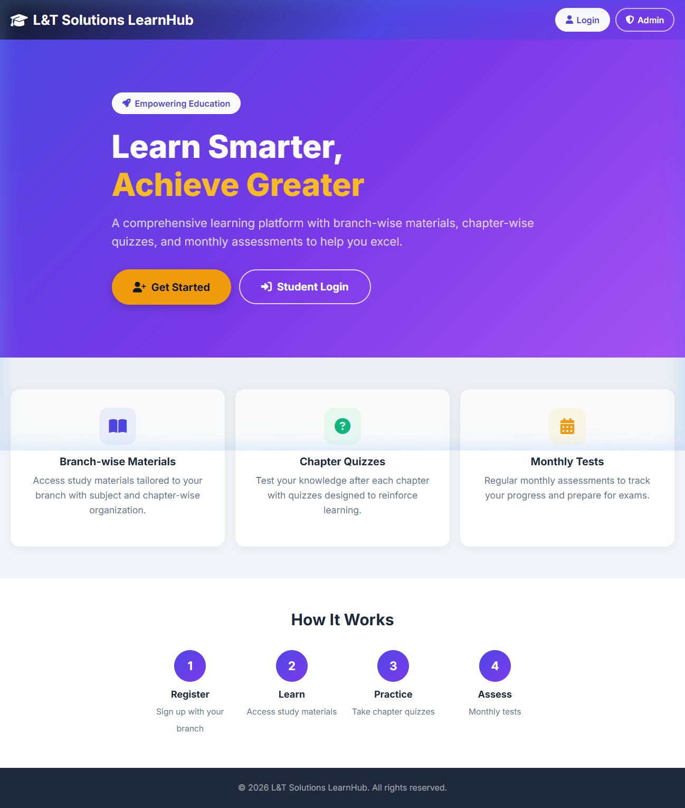
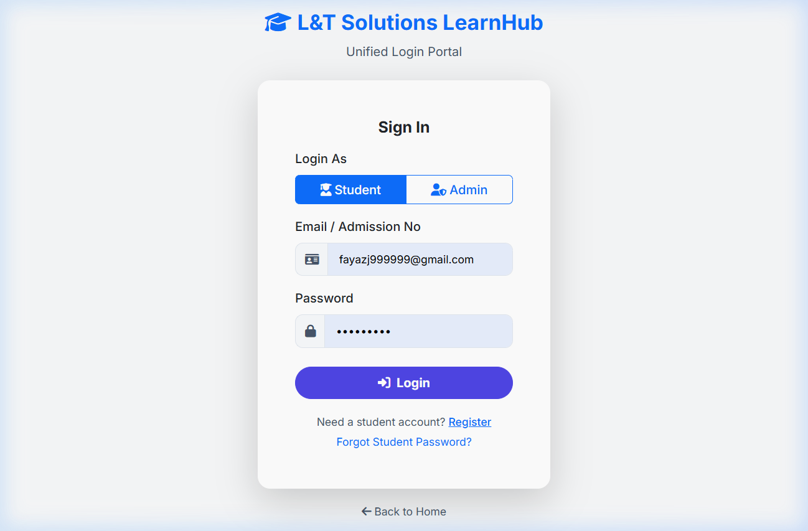

# 🎓 L&T Solutions LearnHub

<p align="center">
  
</p>

<p align="center">
  <strong>A modern, branch-based educational learning management platform.</strong>
</p>

<p align="center">
  <a href="https://l-t-solutions.gt.tc/"></a>
</p>

<p align="center">
  
  
  
  
</p>

---

## 🌟 Overview

**L&T Solutions LearnHub** is a comprehensive educational portal designed to facilitate branch-based learning and student assessment. By dividing access between a student learning dashboard and an administrative command center, the platform ensures seamless content distribution, interactive student evaluation, and progress tracking.

### 🌐 Live Platform
The application is fully deployed and can be accessed at:  
👉 **[https://l-t-solutions.gt.tc/](https://l-t-solutions.gt.tc/)**

---

## 📸 Screenshots

### 🏠 Homepage Dashboard
Features a responsive, modern landing page with quick login access for both students and administrators.


### 🔑 Unified Sign-In Portal
A unified login screen that supports secure role-based access switching between students and admins.


---

## ⚡ Key Features

### 👨‍🎓 For Students
- **Dashboard Overview:** Real-time metrics of enrolled subjects, chapters, materials, and test progress.
- **Branch-Wise Learning:** Structured study materials customized based on the student's registered branch.
- **Chapter-Wise Quizzes:** Interactive practice quizzes after each chapter to self-assess learning retention.
- **Timed Monthly Tests:** Dedicated examinations with real-time countdown timers and automated grading.
- **Material Previewer:** View uploaded study materials directly inside the browser.

### 🛡️ For Administrators
- **Branch & Course Management:** Add, edit, and remove branches, subjects, and specific chapters.
- **Learning Material Management:** Upload reference books, lecture notes, and PDFs categorized by chapter.
- **Quiz Builder:** Create, update, and manage multiple-choice questions for student practice.
- **Monthly Test Administration:** Set up tests with custom durations, assign questions, and review results.
- **Student Management:** View student databases, manage admission statuses, and view exam score logs.

---

## 🛠️ Technology Stack

- **Backend Logic:** PHP 8.x
- **Database:** MySQL / MariaDB
- **Frontend Styling:** Vanilla CSS, Bootstrap 5.3
- **Icons & Fonts:** FontAwesome 6.4, Inter Font Family
- **Server Support:** Apache / Nginx / PHP built-in server

---

## 📂 Project Structure

```text
├── admin/               # Administrative dashboard and CRUD operations
├── student/             # Student dashboard, quiz, and test interfaces
├── includes/            # Core DB configuration, sessions, and helper functions
│   ├── config.php       # Environment configuration and path settings
│   └── db.php           # Database queries and utility functions
├── assets/              # Static assets
│   ├── css/             # Custom stylesheet overrides (style.css)
│   └── screenshots/     # Homepage and UI preview screenshots
├── uploads/             # Destination folder for uploaded study materials
├── index.php            # Public landing page
├── login.php            # Unified login portal
└── material_view.php    # Shared document preview helper page
```

---

## 🚀 Quick Setup & Installation

Follow these steps to run the project locally on your machine:

### Prerequisite Checklist
- **PHP** >= 8.0 installed
- **MySQL / MariaDB** server running
- A local server utility (e.g., XAMPP, WampServer, or PHP CLI)

### Step 1: Clone the Repository
```bash
git clone https://github.com/fayaz786sret/L-T-Solutions.git
cd L-T-Solutions
```

### Step 2: Set Up the Database
1. Open your database administration tool (such as phpMyAdmin).
2. Create a new database named `learning_platform`.
3. Import the tables and schema (usually provided via a `.sql` dump) into the newly created database.

### Step 3: Configure Environment
1. Navigate to the `includes` folder.
2. Edit `config.php` to match your local server credentials:
   ```php
   define('DB_HOST', 'localhost');
   define('DB_USER', 'your_username');
   define('DB_PASS', 'your_password');
   define('DB_NAME', 'learning_platform');
   define('SITE_URL', 'http://localhost:8080');
   ```

### Step 4: Launch Local Server
If using PHP's built-in CLI server, run this command in the project root:
```bash
php -S 127.0.0.1:8080 -t .
```

Then visit the local site in your browser:
- Homepage: `http://127.0.0.1:8080/`
- Login: `http://127.0.0.1:8080/login.php`

---

## 📄 License

This repository and its source code are internal projects property of **L&T Solutions**.